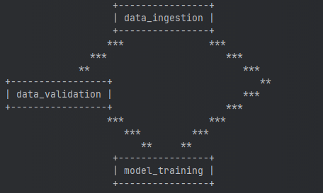
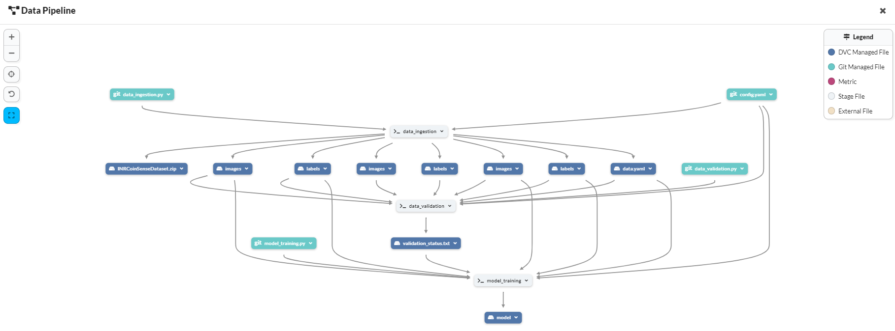

## INRCoinSense


An object detection and classification system to accurately identify Indian coins using YOLO and PyTorch, 
enhanced with MLOps tools like DVC and MLFlow for efficient data versioning, experiment tracking, and deployment.

------------------------------------------------------------------------------------------------------------------------
## Setting Up the Project:
1. Clone the repository
2. Create a virtual environment using setup.sh:
    ```
    bash setup.sh 
    ```
3. Activate the virtual environment (optional, if not done in step 2)
    ```
    source activate ./venv
    ``` 
------------------------------------------------------------------------------------------------------------------------

## Workflow:
1. Update config: `config/config.yaml`
2. Update raw/processed data schema: `raw_schema.yaml/processed_schema.yaml` (if needed)
3. Update model parameters: `params.yaml` (if needed)
4. Update the entity: `src/INRCoinSense/entity/config_entity.py`
5. Update the configuration manager: `src/INRCoinSense/config/configuration.py`
6. Update the components: `src/INRCoinSense/components`
7. Update the pipeline: `src/INRCoinSense/pipeline`
8. Update entrypoint: `main.py`
9. Update application: `app.py`

------------------------------------------------------------------------------------------------------------------------

## MLFlow Setup:
Commands to set up the MLFlow environment:
1. MLFlow Tracking URI:
   ```
   export MLFLOW_TRACKING_URI=https://dagshub.com/heydido/INRCoinSense.mlflow
   ```
2. MLFlow Tracking Username:
   ```
   export MLFLOW_TRACKING_USERNAME=<user_name>
   ```
3. MLFlow Tracking Password:
   ```
    export MLFLOW_TRACKING_PASSWORD=<********>
    ```
Get these from the DAGsHub server.

------------------------------------------------------------------------------------------------------------------------

## DVC Setup:
Commands to set up the DVC environment:

1. Initialize DVC (onetime):
   ```
   dvc init
   ```
2. Write the DVC file: `dvc.yaml` (onetime)

3. Run the DVC pipeline:
   ```
   dvc repro
   ```
   `Note:` "dvc repro" will fail if you haven't exported the MLFlow variables as explained in the MLFlow Setup section. 

4. Track each experiment changes with git:
    ```
    git add .
    git commit -m "DVC: <message>"
    git push origin main
    ```
5. Add DVC Remote (one-time):
    ```
    dvc remote add origin s3://dvc
    dvc remote modify origin endpointurl https://dagshub.com/heydido/INRCoinSense.s3
    ```
6. Push the DVC changes:
    ```
    dvc remote default origin (onetime)
    dvc push
    ```
   
## DVC DAG:


------------------------------------------------------------------------------------------------------------------------

## Complete Data Pipeline:


for better clarity, visit the DAGsHub repo: [INRCoinSense](https://dagshub.com/heydido/INRCoinSense)

------------------------------------------------------------------------------------------------------------------------
Owner: [Aashish Kumar](https://www.linktr.ee/heydido)
------------------------------------------------------------------------------------------------------------------------

This project is created using a public template I created: [MLProjectTemplate](https://github.com/heydido/MLProjectTemplate)